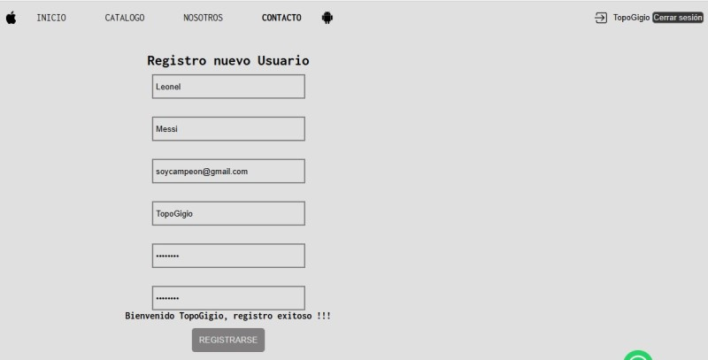
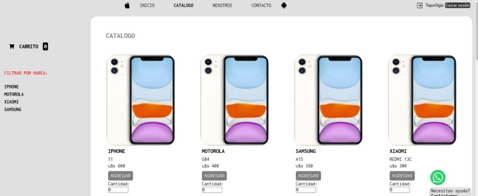
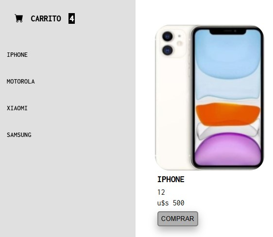
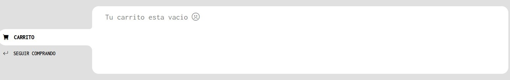
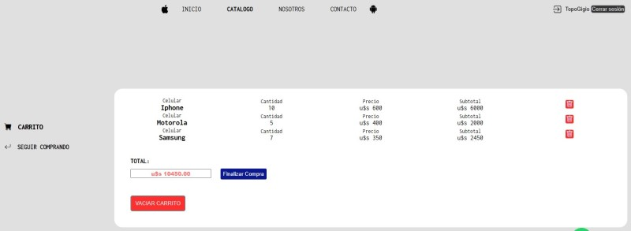

# Proyecto Comisión 65350

 
 

## Capitan Phone

 
 

 
 

**DESARROLLO TERMINADO**

 

 
 

Una web dedicada a la venta y distribución de celulares. En la misma podras acceder a las últimas novedades, nuestro catálogo de productos, conocer más sobre nosotros y nuestro equipo, y finalmente contactarnos por cualquier consulta.

### IMPORTANTE !!! (POR ERROR CON POLITICA CORS, el proyecto debe ser inciado en Live Server de VSC o Pages de Github)

### Estructura del Desarrollo

 

1. Inicio
2. Catálogo
3. Carrito
4. Sobre nosotros
5. Contacto
6. Registro
7. Construcción

### Herramientas utilizadas

 

    <table>
        <tr>
            <td align="center">
                
                
 <b>HTML 5</b> 
                
            </td>
            <td align="center">
                
                
 <b>CSS 3</b> 

            </td>
           <td align="center">
                
                
 <b>Javascript</b> 
      
            </td>
        </tr>
    </table>

 

### Opciones de navegación con DOM 

 

1. Registro de usuario (En esta sección sólo se podran inresar los datos para modificar el botón "Iniciar sesión" por el usuario ingresado)

 

2. Ver Catálogo 

 

3. Incremento de número en Carrito cuando se utiliza el botón comprar

 

4. Carrito de compras vacío 

 

5. Carrito de compras con ítems

 

