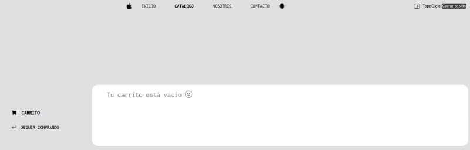

# Proyecto Comisión 65350

 
 

## Capitan Phone

 
 

 
 

**DESARROLLO TERMINADO**

 
 

 
 

Una web dedicada a la venta y distribución de celulares. En la misma podras acceder a las últimas novedades, nuestro catálogo de productos, conocer más sobre nosotros y nuestro equipo, y finalmente contactarnos por cualquier consulta.

### Estructura del Desarrollo

 

1. Inicio
2. Catálogo
3. Carrito
4. Sobre nosotros
5. Contacto
6. Construcción

### Herramientas utilizadas

 

    <table>
        <tr>
            <td align="center">
                
                
 <b>HTML 5</b> 
                
            </td>
            <td align="center">
                
                
 <b>CSS 3</b> 

            </td>
           <td align="center">
                
                
 <b>Javascript</b> 
      
            </td>
        </tr>
    </table>

 

### Opciones de navegación con DOM 

 

1. Inicio de Sesión / Registro de usuario 

 

2. Ver Catálogo

 

3. Incremento de número en Carrito cuando se utiliza el botón comprar

 

4. Carrito de compras vacío 

 

5. Carrito de compras con ítems

 

